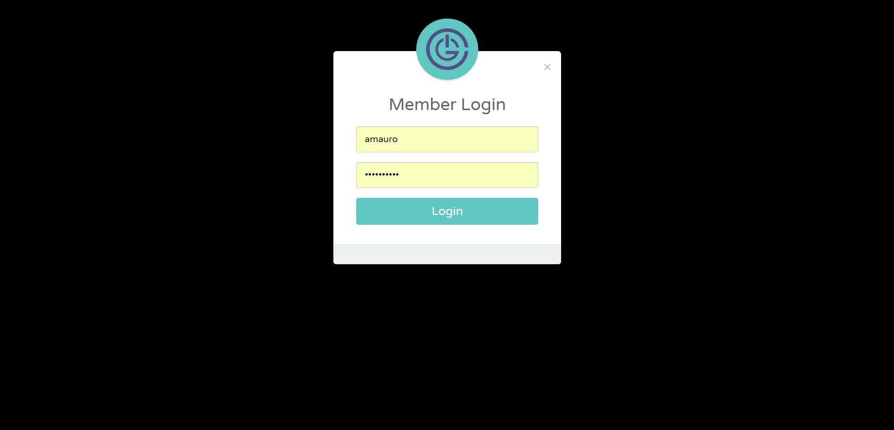
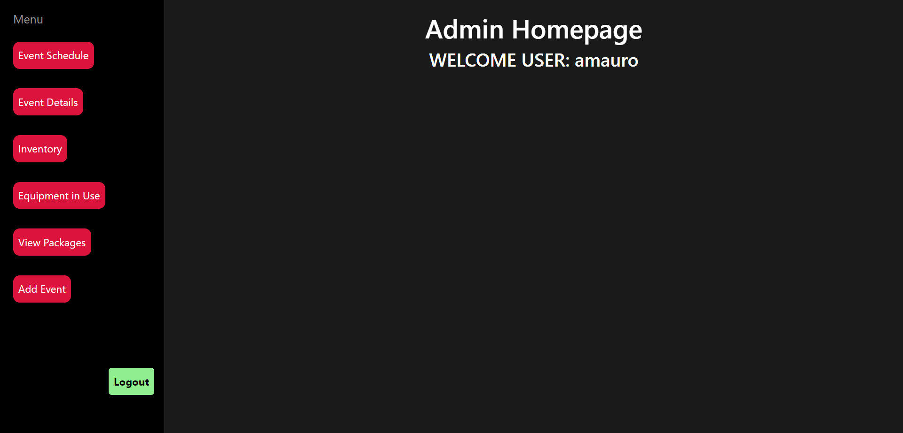
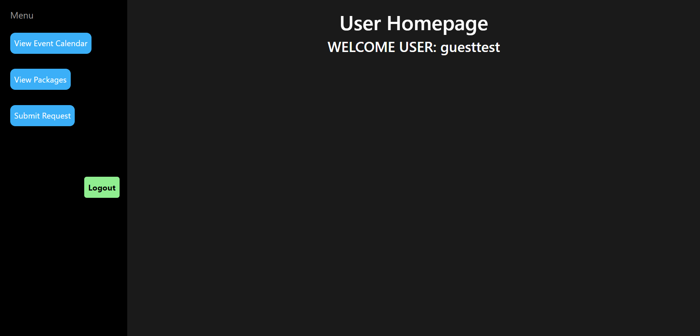
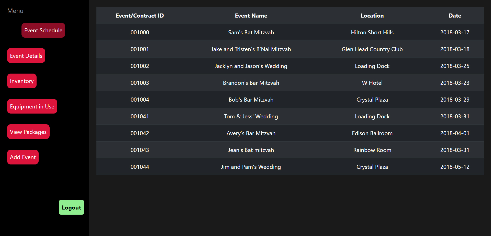

# Final635

Link to site: http://ec2-18-188-136-24.us-east-2.compute.amazonaws.com/index.php

#### Users:
- admin:amaruo pw:ampassword
- user:guesttest pw:gpassword

New Design!
- Redsigned the site using Bootstrap

### Common Deliverables
- Live Replications with M/S on a second VM
    - Achieved by creating a second AWS Ubuntu 16.04 instance and changing bind addressing to reference the master. Created a slave_user for database access. Files can be found in the DBreplication folder.
- Scheduled Incremental Backups (With Backup Rotation)
    - Using Percona, a full backup is taken and then incremental backups are done every hour if there are changes.
     - Files related to this are: backup-mysql (cron), backup-mysql.sh, extract-mysql.sh, prepare-mysql.sh.
- Reimplement one of your tables in Mongo (mlab or run it locally)
    - Recreated my requests table via MLab Mongo. Check "Mongo" folder
- Enforce the first three normal forms on your MYSQL database
    - Enforced
- Implement one of your common queries as a stored procedure
    - My stored procedure is used to get the company inventory, called getinventoryyy.sql. It is utilized when an admin clicks on the "inventory" button
- Document your database layout in UML
    - Can be checked in my DBUML.jpg file
- All midterm deliverables are still required
    - Working
